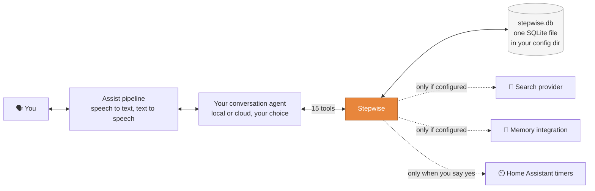
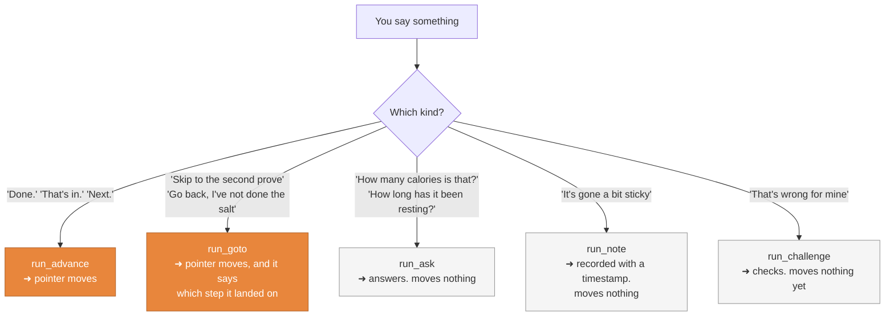
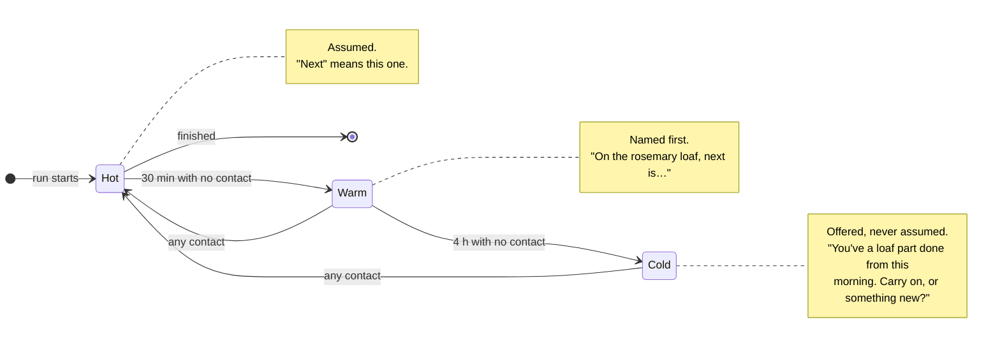
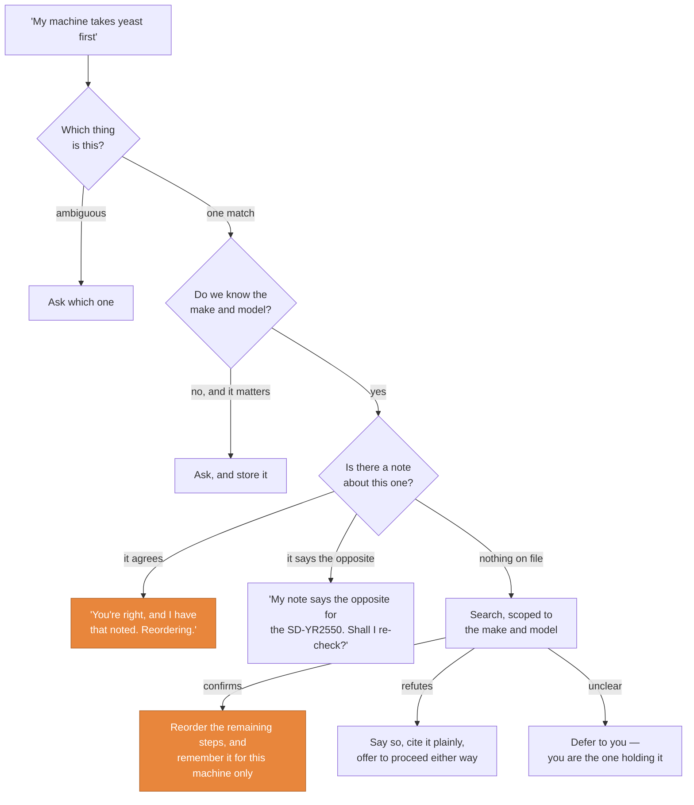
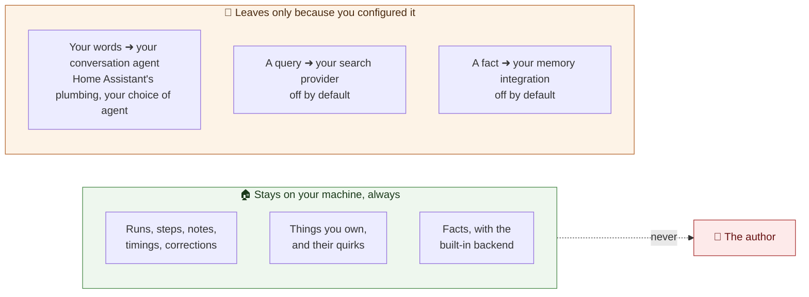

# Stepwise

[![GitHub Release][releases-shield]][releases]
[![HACS][hacs-shield]][hacs]
[![Validate][validate-shield]][validate]
[![License][license-shield]](LICENSE)
[![Maintainer][maintenance-shield]][maintainer]

**Your voice assistant, walking you through a job — hands free, one step at a
time, across days, and picking up exactly where you left off.**

[](https://my.home-assistant.io/redirect/hacs_repository/?owner=ianmin2&repository=home-assistant-stepwise&category=integration)
[](https://my.home-assistant.io/redirect/config_flow_start/?domain=stepwise)

---

> **"Guide me step by step."**
> *"First, two hundred grams of wholemeal flour."*
> **"My machine takes yeast first and salt at the top."**
> *"Checking… you're right, that's this model. Reordering the rest. Yeast first
> on yours, then the flour."*
> **"Tell me when the ingredients are in."** …
>
> *— doorbell goes, you disappear for two hours —*
>
> **"Where were we?"**
> *"On the rosemary loaf, you're on step three of nine, five grams of dried
> yeast. Last touched two hours ago."*

That last line is the entire product.

## The thing nobody else does

A checklist app can list steps. Any assistant can read you a recipe. What
neither can do is let you **stop in the middle** — because the doorbell went, or
because it's Tuesday now — and pick up without re-reading anything.

Stepwise is a stopwatch, not a cookbook. A stopwatch has no opinion about what
you're timing, and is unyielding about exactly one thing. Stepwise has no
opinion about what you're doing, and is unyielding about **knowing where you
are in it**.

|  | Checklist app | Asking an assistant each time | **Stepwise** |
|---|---|---|---|
| Resume after two days | Scroll and guess | Re-explain everything | **"Where were we"** |
| Ask a question mid-task | Lose your place | It forgets the task | **Answers, moves nothing** |
| "That's wrong for my model" | Not possible | Forgotten tomorrow | **Checks, reorders, remembers** |
| How long the dough's been resting | No idea | No idea | **To the minute** |
| Two jobs on the go at once | Two lists | Confusion | **Told apart by name** |
| Works with your existing assistant | — | — | **Any HA conversation agent** |

## It isn't about bread

Bread is just the easiest example to write down. Nothing in the design knows
what a loaf is.

| | | |
|---|---|---|
| **🔧 Fixing** | **🔨 Building** | **🔬 Recording** |
| Converting a radiator to a TRV. Bleeding a heating system. Descaling the dishwasher. Changing a car's air filter. | Wiring an ESP32 project. Flat-pack. Soldering a kit. A subject that doesn't exist yet, with a bill of materials and which parts have arrived. | A reaction logged against elapsed time. Observations at step four. Picked up after lunch. Protocol-following is the same shape as baking. |
| **🚲 Maintaining** | **🩺 Repeating** | **🍞 Cooking** |
| A chain swap on *which* bike? It asks, because a quirk learned about a derailleur bike must never reach a singlespeed. | A physio routine, three times a week. Never a streak, never a nag, never a word about the fortnight you missed. | Quantity before the ingredient, because the ear needs the number first when your hands are covered in dough. |

## How it hangs together

Stepwise adds a set of tools to whichever conversation agent you choose. Your
agent does the talking; Stepwise holds the state.



The dotted lines are the point: **nothing is on by default**, and nothing leaves
your machine unless you configured it to.

### One utterance, one effect

The most damaging failure a tool like this can have is silently being on a
different step from you. So only one kind of thing moves the pointer.



**Asking a question must be free.** Anything that punishes curiosity by losing
your place is broken.

### Hot, warm, cold

How long since you last touched a job decides how it gets spoken about. Both
thresholds are yours to set — the same integration serves a loaf and a
twelve-hour reaction.



Any contact resets the clock, so a job you touch every twenty minutes for nine
hours stays hot throughout. Several can be live at once; the **reference** —
"the rosemary loaf", "the landing radiator" — is how they're told apart.

## Worked examples

<details open>
<summary><b>🍞 A loaf, over two days, with a correction</b></summary>

> **You** — "I'd like to make a rosemary tangzhong loaf on my Panasonic bread machine. Fetch me a recipe."
> **Stepwise** — *"Nine steps for a rosemary tangzhong loaf. Shall I call it the rosemary loaf?"*
>
> *(next morning)*
>
> **You** — "Guide me step by step."
> **Stepwise** — *"Two hundred grams of wholemeal flour. Tell me when that's done."*
> **You** — "My machine takes yeast first and salt at the top, opposite to most."
> **Stepwise** — *"Nothing on file for the SD-YR2550 — let me check… confirmed. Reordering the rest. Yeast first on yours, then the flour."*
> **You** — "Done." … "Done." … "It's gone a bit sticky."
> **Stepwise** — *"Noted."*
> **You** — "How long has the tangzhong been resting?"
> **Stepwise** — *"Forty minutes on this step, an hour and ten altogether."*
>
> *(doorbell. two hours pass.)*
>
> **You** — "Where were we?"
> **Stepwise** — *"On the rosemary loaf, you're on step six of nine, ten grams of chopped rosemary."*
> **You** — "Go back, I've not done the salt yet."
> **Stepwise** — *"Right, step four, seven grams of salt."*
>
> *(…later)*
>
> **Stepwise** — *"Programme four, medium crust. That's the wholemeal one on yours. Shall I set a timer for three hours ten? That's the programme length."*
>
> **Next month, same machine:** *"Yeast first on yours, then the flour."* — said before it's relied on, so you can correct it in two words if the ground has moved.

</details>

<details>
<summary><b>🚲 "Change my bike chain" — which bike?</b></summary>

> **You** — "Talk me through changing my bike chain."
> **Stepwise** — *"Which one, the winter bike or the summer bike?"*
> **You** — "Winter."
> **Stepwise** — *"Eleven speed on that one, so it needs a quick link rather than a pin — you told me that in March. Still right?"*
> **You** — "Yes."
> **Stepwise** — *"Right. First, shift onto the smallest ring at both ends."*
>
> Two bicycles are two subjects. A quirk learned about one is **never** applied
> to the other — because a quirk about a derailleur bike, silently applied to a
> singlespeed years later, is worse than having learned nothing: it is
> confidently wrong, mid-instruction, while your hands are covered in oil.

</details>

<details>
<summary><b>🔬 A reaction, logged as it happens</b></summary>

> **You** — "Start the protocol on batch seven."
> **Stepwise** — *"Step one, bring the buffer to thirty-seven degrees."*
> **You** — "Done." … "It's gone cloudy."
> **Stepwise** — *"Noted, on step four."*
>
> *(after lunch)*
>
> **You** — "Where were we?"
> **Stepwise** — *"On batch seven, you're on step four, and it's been two hours and ten minutes since you last touched it. You noted it went cloudy at forty minutes in."*
>
> Every advance, note, question and correction is timestamped in an append-only
> log. A run's history *is* a lab notebook, and it is already written.

</details>

<details>
<summary><b>🔧 A radiator valve, where being wrong matters</b></summary>

> **You** — "Swap the landing radiator to a thermostatic valve."
> **Stepwise** — *"What pipe size is it? It changes which valve fits."*
> **You** — "Fifteen mil."
> **Stepwise** — *"Noted, fifteen millimetres. First, close the valve at both ends and drain it down. Tell me when that's done."*
>
> It asks for a make, model or measurement **only when the answer changes the
> steps**, and never wastes your time asking when it doesn't. It is not a form.

</details>

## Quick start

**1. Install.** Click the button, or add
`https://github.com/ianmin2/home-assistant-stepwise` in *HACS → ⋯ → Custom
repositories*, category *Integration*.

[](https://my.home-assistant.io/redirect/hacs_repository/?owner=ianmin2&repository=home-assistant-stepwise&category=integration)

**2. Restart** Home Assistant.

**3. Add the integration.**

[](https://my.home-assistant.io/redirect/config_flow_start/?domain=stepwise)

**4. Give an agent the tools.** *Settings → Devices & Services →* your
conversation agent *→ Configure → Control Home Assistant →* tick **Stepwise**.

> 💡 Give it to the agent that *thinks*. An agent without it ticked is entirely
> unaffected, so you can run one assistant with Stepwise and one without.

**5. Say something.** "Talk me through descaling the kettle." That's it.

### Requirements

| | |
|---|---|
| Home Assistant | 2026.1 or newer |
| A conversation agent | Any that supports tools — local or cloud, your choice |
| A search provider | Optional. Without one it uses your agent's own knowledge, and says so |
| A memory integration | Optional. Facts live in the local database otherwise |

## Settings

The first two are the ones that matter, and the reason this serves a loaf and a
twelve-hour reaction equally.

| Setting | Default | What it decides |
|---|---|---|
| **Assume this run for** | 30 min | While hot, "next" means the job in progress, with no preamble |
| **Offer rather than assume after** | 4 h | Past this it is offered, never assumed |
| Units | Metric | Quantities are *converted* for reading aloud — a recipe in grams read out in ounces. The stored step keeps what the source said |
| Moving on | Wait to be told | Whether silence can ever advance a step. It cannot, by default |
| Naming a run | Propose | Propose a name, always ask, or never ask |
| Long term facts | Built in | Local table, or ha-ai-memory |
| Looking things up | None | None, a `rest_command` you already have, or an add-on |
| Finished runs kept | 20 per thing | Runs archive themselves; the database stays small by construction |

**Options → Things and their quirks** lists everything it knows you own, with
every learned quirk, where it came from and when it was last confirmed. A wrong
quirk that cannot be seen is permanent — so they are all visible, and any of
them can be forgotten in one tap.

**Options → Put a run down** closes a stuck job. Worded as a fact, not a
failure.

## When you say it's wrong

The bit that isn't a checklist.



Three rules underneath it:

- **The person in the room outranks the internet** about their own things — but
  is always told when they are being contradicted. Never a silent override, in
  either direction.
- **A contradiction is a fork, not an update.** "There's no derailleur on this
  one" usually means *this is a different bike*, so it asks before overwriting
  anything.
- **Quirks are said, never silently obeyed** — and saying one never confirms it.
  Only you can do that.

## Built for interrupted attention

Losing your place is the normal case, not the failure case. Everyone works that
way sometimes: a phone ringing, a child in the room, oily hands and no free
finger to scroll with. That decides the architecture, not the polish.

- **Resuming costs one utterance.** Never re-read, never scroll, never find your
  place in a list.
- **A gap is never failure.** No streaks, no nagging, no progress bar implying
  you are behind. A run left for three days is simply a run left for three days.
- **The system holds the state, not you.** Never *"you'd done the salt, right?"*
  — it knows, because it wrote it down with a timestamp when it happened.
- **No shame in the wording, ever.** *"You still have a loaf half done"* is a
  fact. *"You never finished your loaf"* is a judgement, and it is why people
  stop opening apps.

## Your data



**No telemetry. No analytics. No crash reporting. No usage statistics. No
hardcoded endpoint anywhere in the codebase.** Everything lives in one SQLite
file next to the rest of your Home Assistant data — inspectable, diffable,
backed up with everything else, and deleted by deleting the file.

Nothing is written implicitly either: facts only enter through an explicit tool
call, which is the single biggest cause of memory rot in projects like this.

## Under the bonnet

<details>
<summary><b>The fifteen tools</b></summary>

Deliberately few. Each does one thing and returns one speakable line plus
structured detail.

| Tool | Purpose |
|---|---|
| `resolve_intent` | The requirements conversation. Searches what you already have first, offers phonetic candidates for misheard terms, reports what still needs asking |
| `subject_resolve` | "My bike" into one thing, or a question |
| `subject_save` | Record or amend a thing, including a make and model it asked for |
| `procedure_plan` | Store the steps and propose a name. Starts nothing |
| `run_start` | Begin. Returns step one and the reference |
| `run_where` | Where am I, in which thing, how long since. **Takes no arguments, by design** |
| `run_advance` | Complete this step, return the next. The only tool that moves a run on |
| `run_goto` | Reposition by description, always reporting where it landed |
| `run_ask` | An aside. Answers from the procedure, the notes or the clock |
| `run_note` | An observation, against the step and the time |
| `run_challenge` | You dispute a step. Agrees, contradicts, or searches |
| `run_amend` | Change a step or the order — scoped to this run, this thing, or the template |
| `quirk_confirm` | Your answer when a quirk was re-confirmed aloud |
| `run_timer` | Start a Home Assistant timer, after a yes |
| `run_finish` | Close, archive, record how it went |

`run_where()` taking no arguments is not laziness. Anything that requires the
agent to remember an id defeats the entire point.

</details>

<details>
<summary><b>Speech rules that are load-bearing</b></summary>

- **One step at a time.** Never the whole list unless asked.
- **Quantity before the ingredient.** "Two hundred grams of wholemeal flour" —
  the ear needs the number first when hands are busy.
- **Units said as words**, so text-to-speech says *grams*, not *gee*.
- **Never summarise a set.** Asked what is left, it lists the steps. "A few
  more" is not an answer.
- **Await explicitly**, then stop talking. Silence is never agreement.
- **Timers offered with their reason**, never imposed.

</details>

<details>
<summary><b>Storage</b></summary>

One SQLite file: `subjects, procedures, procedure_steps, runs, run_steps,
run_events, run_amendments, quirks, facts`.

`run_events` is the append-only spine — every advance, reposition, note,
question and correction, timestamped. Elapsed-time answers, the hot/warm/cold
classification and the readable history all derive from it.

A run **owns its steps**, copied when it starts, so amending one changes that
run and never the template somebody else is following.

Bounded by construction: quirks supersede rather than accumulate, runs archive,
procedures deduplicate.

</details>

<details>
<summary><b>Docs</b></summary>

| | |
|---|---|
| [PLAN.md](PLAN.md) | The design this was built from. Read it before changing anything |
| [docs/subjects.md](docs/subjects.md) | Things, identity, quirks, and the `programmes` convention |
| [docs/procedures.md](docs/procedures.md) | The step schema, addressing, amendment scoping |
| [docs/releasing.md](docs/releasing.md) | Brands, tags, HACS |
| [CHANGELOG.md](CHANGELOG.md) | What changed |

</details>

## Two deliberate differences from the design

- **No conversation-agent multi-select.** Home Assistant attaches LLM APIs from
  the agent's own settings, so a picker here would be a second switch that could
  disagree with the real one.
- **Three extra tools.** `subject_save`, `quirk_confirm` and `run_timer` exist
  because the design requires asking for a make and model, re-confirming quirks
  and offering timers — none of which work without somewhere to put the answer.

## Development

The core carries no Home Assistant imports, so it runs anywhere:

```bash
python3 -m unittest discover -s tests   # 120 tests
ruff check custom_components tests
```

Both run in CI on every push, alongside Home Assistant's `hassfest` and the HACS
validator. Every rule in the design that can be tested is tested against the
bread example — including the whole two-day journey, played end to end with a
day in the middle.

## Licence, liability and data

MIT — see [LICENSE](LICENSE). Use it, fork it, sell it, keep the notice.

**It is provided as-is, and no liability is accepted for anything arising from
its use.** That matters more here than in most projects, because Stepwise reads
out steps for *physical* work, composed by a language model or taken off the
web. Check anything that could hurt you or damage property against the
manufacturer's own instructions, get a qualified person for gas, electrical,
structural or medical work, and treat your own judgement as outranking the
software. If a step looks wrong, it is wrong until proven otherwise.

The full statement is in [DISCLAIMER.md](DISCLAIMER.md).

## Credits

Designed by [@ianmin2](https://github.com/ianmin2) — [PLAN.md](PLAN.md) is the
document everything here was built from.

Phases 1 to 5 were implemented by Claude Opus 5, working in
[Claude Code](https://claude.com/claude-code) from that plan.

[releases-shield]: https://img.shields.io/github/release/ianmin2/home-assistant-stepwise.svg?style=for-the-badge
[releases]: https://github.com/ianmin2/home-assistant-stepwise/releases
[hacs-shield]: https://img.shields.io/badge/HACS-Custom-e8863c.svg?style=for-the-badge
[hacs]: https://github.com/hacs/integration
[validate-shield]: https://img.shields.io/github/actions/workflow/status/ianmin2/home-assistant-stepwise/validate.yml?branch=main&style=for-the-badge&label=validate
[validate]: https://github.com/ianmin2/home-assistant-stepwise/actions/workflows/validate.yml
[license-shield]: https://img.shields.io/github/license/ianmin2/home-assistant-stepwise.svg?style=for-the-badge
[maintenance-shield]: https://img.shields.io/badge/maintainer-%40ianmin2-e8863c.svg?style=for-the-badge
[maintainer]: https://github.com/ianmin2
